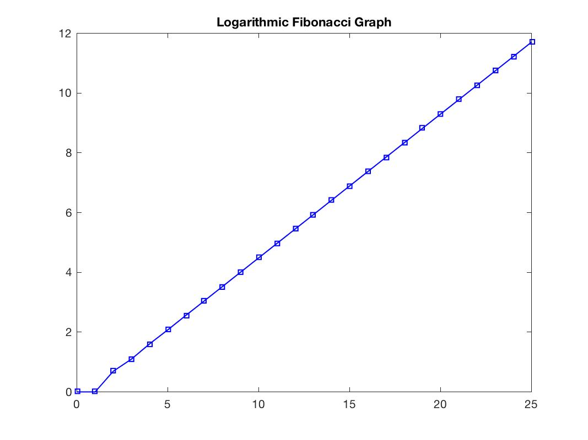

# Assignment 1

### Exercise 1.5.2

#####  Question 1

1. Makea plot of the Fibonacci numbers up to 25. On the x axis should be the number ofthe sequence and on the y axis should be the Fibonacci number. What happens tothe values as the sequence increases? 

   

   In the above plot, we see that the numbers seem to increase logarithmically.

   See Code Attached.

#####  Question 2

2. Now make the same plot but instead of plotting the Fibonacci number, plot the logarithm of the Fibonacci number (use the log function). What does the plot look like now?

   

   The Logarithmic of the Fibonacci numbers areshown as a straight line.

   See code attached


### Exercise 1.5.3

##### Question 1

1. Try to reproduce the plot above showing, for i = 1,...19, how the ratio of subsequent Fibonacci numbers tends to the Golden ratio.

   

   The numbers fluctuate around a value of approximately 1.6180 and gradually becomes a straight line at y=1.6180.


### Source Code

##### Functions File

```matlab
function r = fibonacci(n)
	r = [];
	for elm = n 
		r = [r calculate_fibonacci(elm)];
	end

function f = calculate_fibonacci(n)
	if (n== 0)
		f = 1;
	elseif (n == 1)
		f = 1;
	elseif (n == 2)
		f = 2;
	else
		f = calculate_fibonacci(n-1) + calculate_fibonacci(n-2);
	end
```

##### Script File

```matlab
addpath('./functions') % Load the functions folder into the path

a = 0:25;
f = fibonacci(a);

% Draw Graph
fig = figure;
plot(a, f, '-bs', 'Linewidth', 1, 'Markersize', 5);
title('Fibonacci Curve');
saveas(fig, 'fig1', 'jpg');

fig = figure;
plot(a,log(f), '-bs', 'Linewidth', 1, 'Markersize', 5);
title('Logarithmic Fibonacci Curve');
saveas(fig, 'logfig1', 'jpg');

% ### Exercise 1.5.3
% Create matrix (2 by 20) with the first 20 fibonacci no.
f_20 = [fibonacci(0:18); fibonacci(1:19)]; 
%  Convert each column into a Cell 
C = num2cell(f_20, 1);
% apply a function on each cell (i.e. column)...
ratio = cellfun(@(c) c(2)/c(1), C);

% Draw Graph
fig = figure;
plot(1:19, ratio, '-bs', 'Linewidth', 1, 'Markersize', 5);
hold on;
plot([0,20], [1.6180,1.6180], 'r');
title('Logarithmic Fibonacci Curve');
saveas(fig, 'ratio', 'jpg');
```


