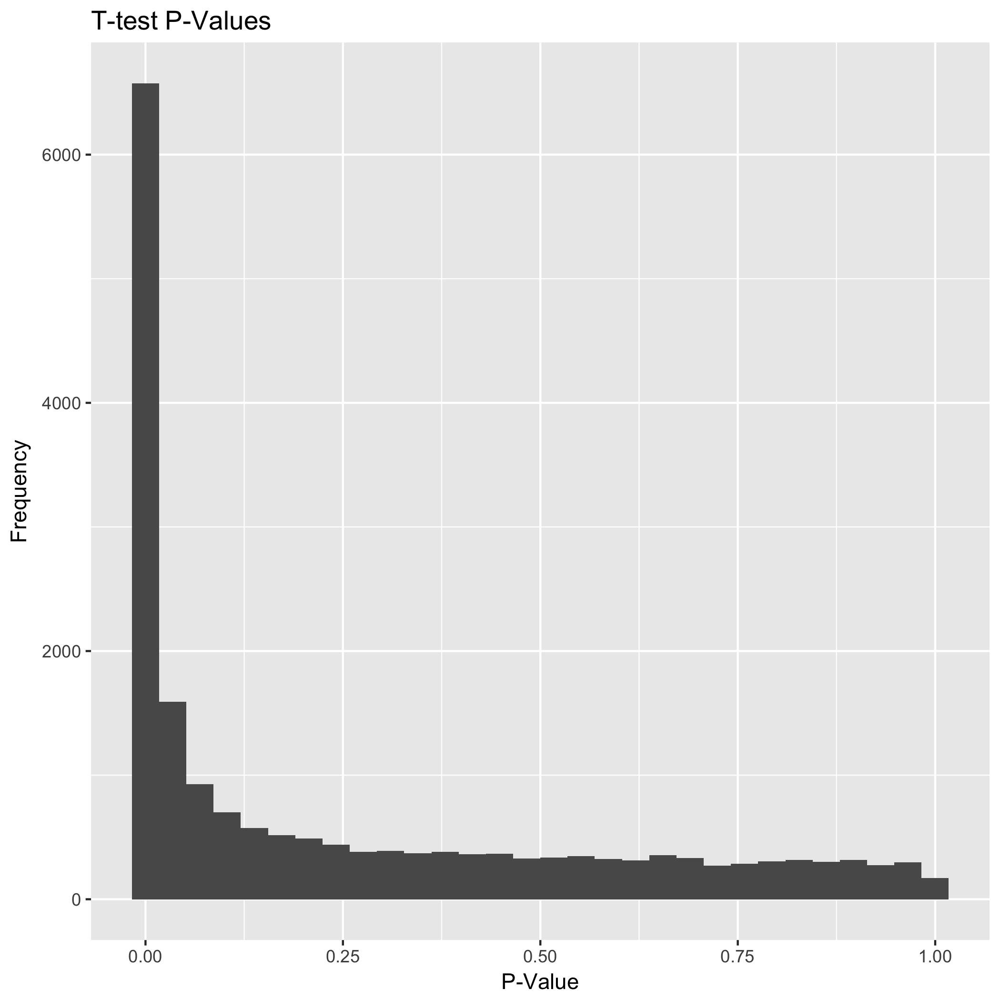

# Assignment 11

### Exercise 2.2.8


#####  Question 1

1. In this question you will write an R loop to perform 1000 t-tests on randomly generated normal data with mean 0. Therefore the null hypothesis is always true but you will see that one still obtains small $p$ values (therefore indicating falsely signifcant results or false positives).


   ```R
   pvalues <- sapply(1:1000, function(i) {
     t.test(rnorm(20,0,1))$p.value
   })
   ```

#####  Question 2

2. Using the which function, count the fraction of times you observe $p$ values less than 0.1, 0.05, 0.01.


   ```R
   length(which(pvalues<0.1))
   # 102
   length(which(pvalues<0.05))
   # 50
   length(which(pvalues<0.01))
   # 10
   ```

#####  Question 3

3. Make a histogram of the $p$ values obtained. What distribution is this? 

   ```R
   library('ggplot2')
   draw_histogram <- function(dataset) {
     dist_mean <- mean(dataset)
     dist_sd <- sd(dataset)
     gg <- ggplot(as.data.frame(dataset), aes(dataset))
     gg <- gg + geom_histogram(aes(y=..density.., fill=..count..))
     gg <- gg + scale_fill_gradient("Count", low="#DCDCDC", high="#7C7C7C")
     gg <- gg + stat_function(fun=dnorm, color="red",
                              args=list(mean=dist_mean,sd=dist_sd))
     # Adds a density plot on top
     gg <- gg + geom_density(alpha = 0.2, fill="steelblue", colour="steelblue")
     gg <- gg + ggtitle(paste("Histogram", "( Mean:", round(dist_mean,2), '|',
                              "sd:", signif(dist_sd,2), ")"))
     return(gg)
   }

   draw_histogram(pvalues)
   ggsave('Assignment/histogram.png')
   ```

   


   As shown by the above histogram, the data seems to follow a continuous uniform distribution.

   ​

### Exercise 2.2.12

#####  Question 1
1. Repeat the analysis above to examine the genes that are differentially expressed after 24 hour exposure to cadmium. Provide a histogram of the t-test p values for this dataset.


   ```R
   library("GEOquery")
   library('ggplot2')

   gds      <- getGEO(filename='GDS3420_full.soft')
   geData   <- Table(gds)
   geData2  <- geData[which( geData['Platform_ORF'] != "" ),]

   # Identify Samples for each factor
   hrs4         <- unlist( strsplit( Meta(gds)$sample_id[1], ',' ) )
   hrs24        <- unlist( strsplit( Meta(gds)$sample_id[2], ',' ) )

   # separate the data for the two factors
   geData_hrs4  <- data.matrix(geData2[, names(geData2) %in% hrs4])
   geData_hrs24 <- data.matrix(geData2[, names(geData2) %in% hrs24])

   top_hits <- function (dataMatrix, genes, identifiers, hits_type='upregulated',
                         fc=2, pvalue=2.57e-6) {
     numNA      <- apply(dataMatrix, MARGIN=1, function(x) sum(is.na(x)) )
     indices    <- which(numNA <= 5)
     
     dataMatrix <- dataMatrix[indices, ]
     genenames <- genes[indices, ]
     symbols    <- identifiers[indices]
     
     foldchange <- apply(dataMatrix, MARGIN=1, function(x){
       median( exp(as.numeric(x)), na.rm=T)
     })

     tresults <- apply(dataMatrix, MARGIN=1, function(x){
       t.test(as.numeric(x))$p.value
     })

     results <- data.frame(pvalue=tresults, FC=foldchange,
                           id=genenames, symbol=symbols)

     gg <- ggplot(results, aes(tresults)) + geom_histogram()
     gg <- gg + scale_fill_gradient("Count", low="#DCDCDC", high="#7C7C7C")
     gg <- gg + ggtitle("T-test P-Values") + xlab('P-Value') + ylab('Frequency')

     if (hits_type == 'upregulated') {
       hits <- results[ which( results$pvalue < pvalue & results$FC > fc ), ]
     } else if (hits_type == 'downregulated') { # 
       hits <- results[ which( results$pvalue < pvalue & results$FC < fc ), ]
     } else {
       cat("ERROR: The hit_type variable in the top_hits() function must be 'upregulated' or 'downregulated'.", file=stderr())
       quit(save = "no", status = 1, runLast = FALSE)
     }
     hits <- hits[order(hits$FC, decreasing=T),]
     
     return (list(hits=hits, histogram=gg))
   }

   results_hrs4  <- top_hits(geData_hrs4, geData2["Gene ID"], geData2[, 'IDENTIFIER'])
   results_hrs24 <- top_hits(geData_hrs24, geData2["Gene ID"], geData2[, 'IDENTIFIER'])

   results_hrs24$histogram
   ggsave('Assignment/results_hrs24.png')
   ```

   

#####  Question 2
2. How many genes are significantly up-regulated?


   ```R
   results_hrs24$hits
   dim(results_hrs24$hits)
   # [1] 99  4
   ```

   As shown above, there 99 hits that are significantly up-regulated.

#####  Question 3
3. How many genes are significantly down regulated ($FC<0.5$)


   ```R
   down_regulated_hrs24 <- top_hits(geData_hrs24, geData2["Gene ID"],
                                    geData2[, 'IDENTIFIER'], 'downregulated', 0.5)
   down_regulated_hrs24$hits
   dim(down_regulated_hrs24$hits)
   # [1] 6 4
   ```

   As show above, there are 6 genes that are significantly down regulated.

   ​