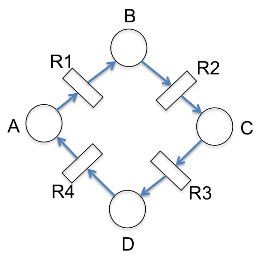
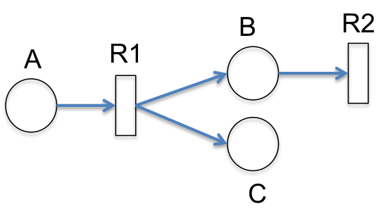

# Assignment 4

### Exercise 1.1.13

##### Question 1

1. Without doing any calculations can you identify any i) conservation laws and ii) sets of reactions which will leave the state unchanged?

   *Conservation Laws:*  A, B, C and D are likely to be p-invariant.

   *Set of Reactions which will leave the state unchanged:* R1, R2, R3, R4 are possibly t-invariant

2. In MATLAB construct the Petri net for this system by defining ss, rr, WsrWsr, WrsWrs and mm. (Assume the state mm contains one token in species A only.) 

3.  Use these to calculate reaction matrix AA and stoichiometry matrix SS.

4. Calculate the P and T invariants for this system and comment on their meanings. Did you identify them in part (a)?

##### Question 2

 

1. Without doing any calculations can you identify any i) conservation laws and ii) sets of reactions which will leave the state unchanged?

2. In MATLAB construct the Petri net for this system by defining ss, rr, WsrWsr, WrsWrs and mm. (Assume the state mm contains one token in species A only.) 

3.  Use these to calculate reaction matrix AA and stoichiometry matrix SS.

4. Calculate the P and T invariants for this system and comment on their meanings. Did you identify them in part (a)?