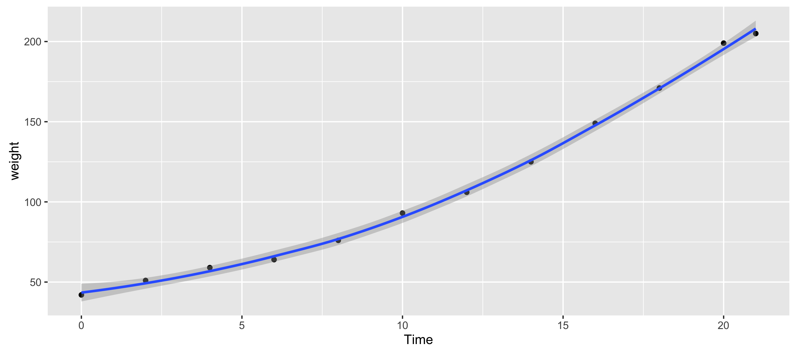
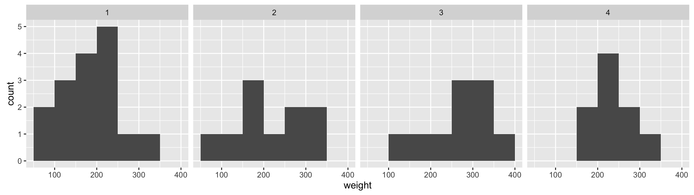
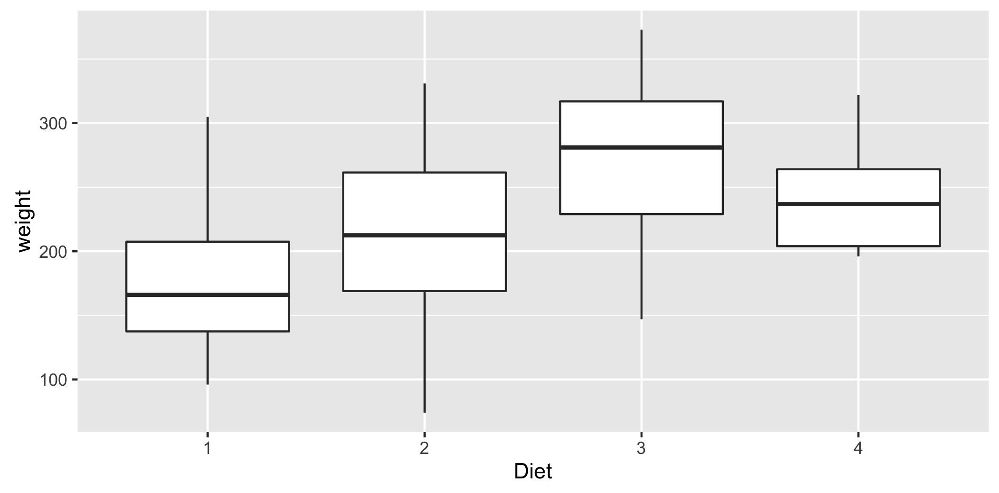

# Assignment 9

### Exercise 1.8.1

#####  Question 1

1. Make a plot of the weight progression of Chick 1 over the 21 days and save it as a PNG file.

   ```R
   library('ggplot2')
   data(ChickWeight)

   ChickWeight1 <- ChickWeight[ ChickWeight$Chick == 1 , ]
   ggplot(ChickWeight1, aes(x=Time, y=weight)) + geom_point() + geom_smooth()
   ggsave('Assignment/scatter.png')
   ```

   

##### Question 2

2. Compare the weight of Chick1 on day 21 and when it was born. How many times heavier is it? 

   ```R
   weight_21 <- ChickWeight1[ChickWeight1$Time == 21,]$weight
   weight_0 <- ChickWeight1[ChickWeight1$Time == 0,]$weight
   weight_21 / weight_0
   # 4.880952
   ```

   Chick 1 was 4.8 times heavier on day 21 compared to the day it was born.


##### Question 3

3. Which of the chicks has the largest weight at 21 days?

   ```R
   idx <- which.max(ChickWeight$weight)
   ChickWeight[idx,]$Chick
   #35
   ```

   Chick 35 is the heaviest chick at 21 days.

##### Question 4

4. Make histograms for the weights of the chicks on the four different diets after 21 days. Save them as PNG files.

   ```R
   ChickWeight21Days = ChickWeight[ChickWeight$Time == 21,]
   ggplot(ChickWeight21Days, aes(weight)
   ) + geom_histogram(breaks=seq(50,400,50)
   ) + facet_grid(Diet ~ .)
   ggsave('Assignment/histogram.png')
   ```

   

##### Question 5

5. Calculate the mean and standard deviations of the chicks on the four different diets after 21 days. On which diet do the chicks appear to be heavier at 21 days? 

   ```R
   aggregate(ChickWeight21Days$weight,
             list(ChickWeight21Days$Diet), mean)
   #   Group.1        x
   # 1       1 177.7500
   # 2       2 214.7000
   # 3       3 270.3000
   # 4       4 238.5556

   aggregate(ChickWeight21Days$weight,
             list(ChickWeight21Days$Diet), sd)
   #   Group.1        x
   # 1       1 58.70207
   # 2       2 78.13813
   # 3       3 71.62254
   # 4       4 43.34775

   ggplot(ChickWeight21Days,aes(Diet, weight)) + geom_boxplot()
   ggsave('Assignment/boxplot.png')
   ```

   

   Looking at the raw data of the means, and the standard deviations of the chicks on the four diets alongs with the box plot, it is obvious to see the chicks on Diet 3 are heavier at 21 days 


