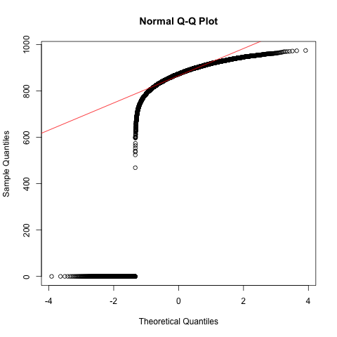
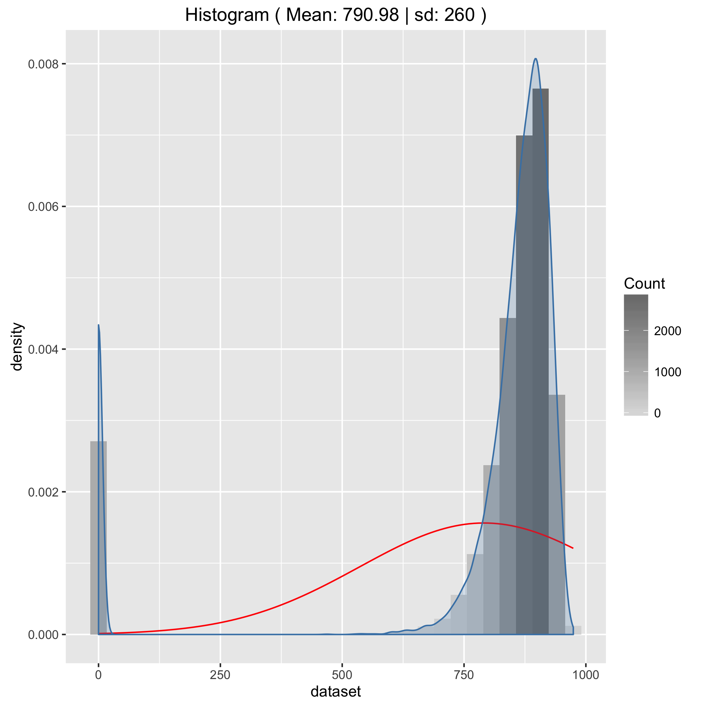
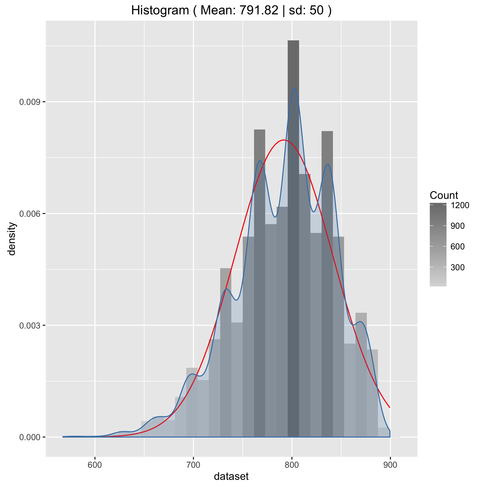
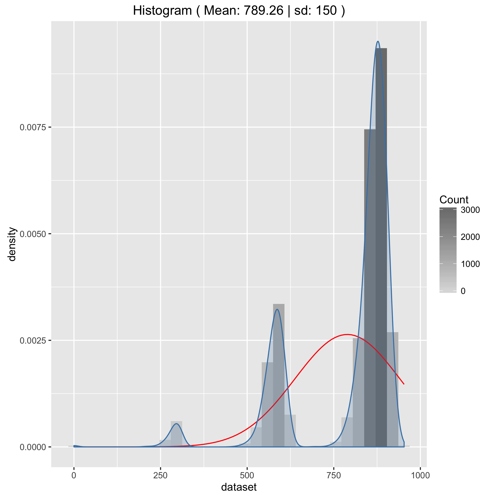
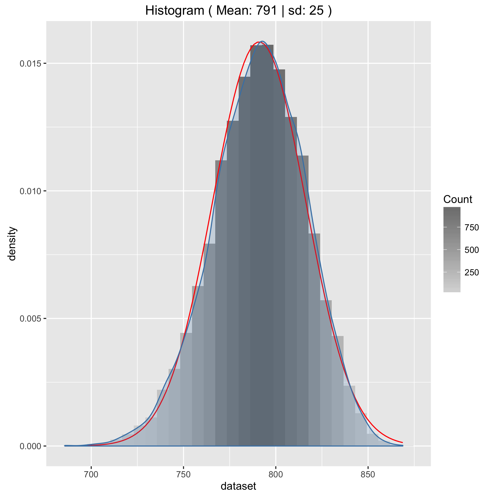
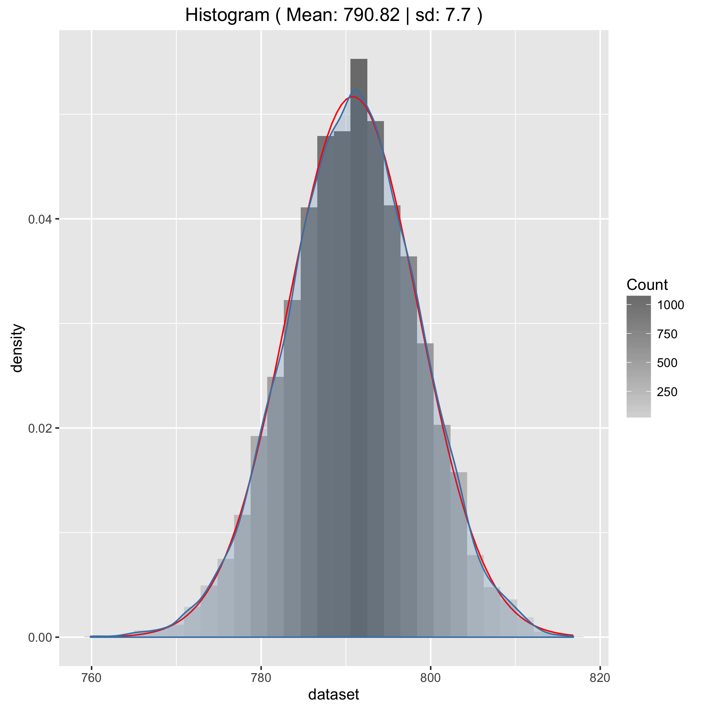
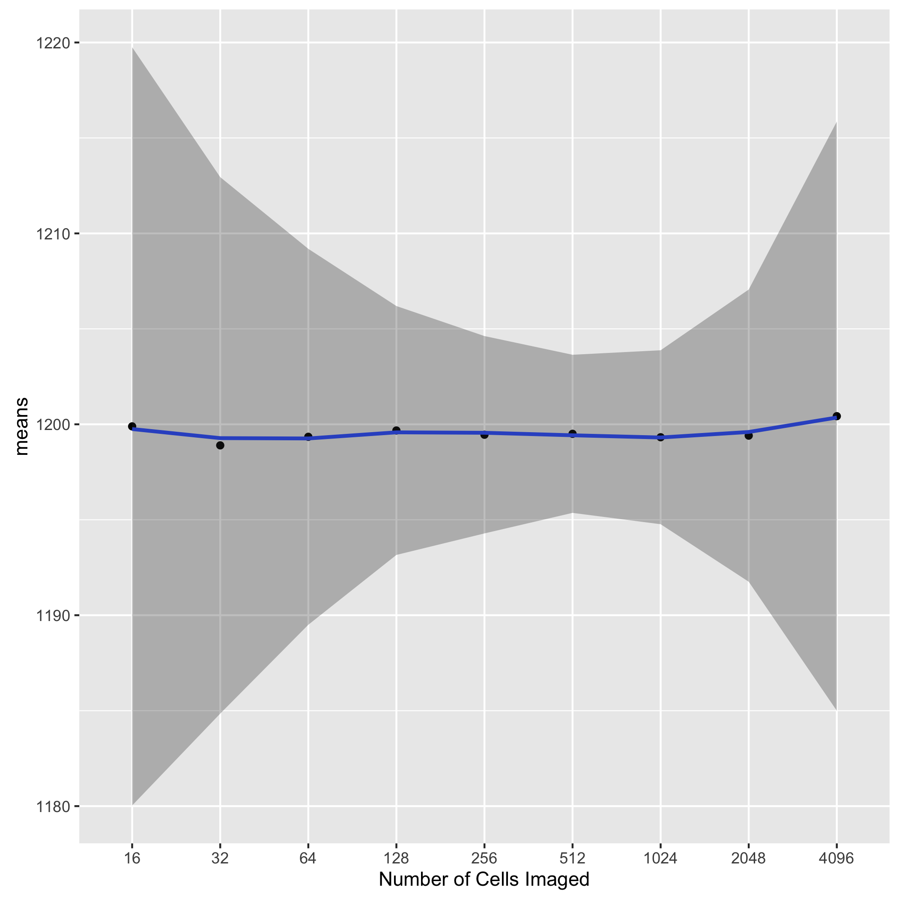

# Assignment 10

### Exercise 1.8.1

#####  Question 1

1. A different cell population is simulated in dataset cell_population_b also contained in the file cell_fluorescence.RData.  Verify that this population does not follow a normal distribution.

   ```R
   # test can only take a maximum of 5000 datapoints, so take sample 
   shapiro.test(sample(cell_population_b,5000)) 
   #   Shapiro-Wilk normality test
   # data:  sample(cell_population_b, 5000)
   # W = 0.49479, p-value < 2.2e-16

   png(filename="Assignment/qqnorm.png")
   qqnorm(cell_population_b)
   qqline(cell_population_b, col='red') 
   dev.off()

   draw_histogram <- function(dataset) {
     dist_mean <- mean(dataset)
     dist_sd <- sd(dataset)
     gg <- ggplot(as.data.frame(dataset), aes(dataset))
     gg <- gg + geom_histogram(aes(y=..density.., fill=..count..))
     gg <- gg + scale_fill_gradient("Count", low="#DCDCDC", high="#7C7C7C")
     gg <- gg + stat_function(fun=dnorm, color="red",
                              args=list(mean=dist_mean,sd=dist_sd))
     # Adds a density plot on top
     gg <- gg + geom_density(alpha = 0.2, fill="steelblue", colour="steelblue") 
     gg <- gg + ggtitle(paste("Histogram", "( Mean:", round(dist_mean,2), '|',
                              "sd:", signif(dist_sd,2), ")"))
     return(gg)
   }

   draw_histogram(cell_population_b)
   ggsave('Assignment/histogram.png')
   ```






<div class="page-break"></div>

#####  Question 2

2. Describe the fluorescence of this cell population, with reference to its distribution shape.

   As shown by the Q-Q plot above together with the histogram below, we can see that the distribution is definitely not normal. Rather, the histogram shows that the distribution of the flourence is skewed to the right with a long tail on the left. 

##### Question 3

3. To investigate the prediction of the Central Limit Theorem write a function repeat_measurements which repeats many measurements on an input population dataset, then plots the distribution of sample means. 

   ```R
   repeat_measurements <- function (dataset, sample_size=25, n_repeats=10000) {
     mean_distribution <- sapply(1:n_repeats, function(r) {
       mean(sample(dataset,sample_size))
     })
     graph <- draw_histogram(mean_distribution)
     return(graph)
   }

   repeat_measurements(cell_population_b, 25, 10000)
   ggsave('Assignment/function_histogram.png')
   ```

   

#####  Question 4

4. Use this function to investigate the behaviour of the sample mean distribution for a low sample sizes of cell_population_b (e.g. sample_size=3)

   ```R
   repeat_measurements(cell_population_b, 3, 10000)
   ggsave('Assignment/function_histogram_sample_size_3.png')
   ```

   

#####  Question 5

5. Next identify a sample size that is large enough so that the distribution looks approximately normal. Note the mean and standard deviation of this distribution.

   ```R
   repeat_measurements(cell_population_b, 100, 10000)
   ggsave('Assignment/almost_normal_histogram.png')
   ```

   

#####  Question 6

6. Increase the sample size by a factor of 10 and note the new values for mean and standard deviation. Is this in line with the central limit theorem?

   ```R
   repeat_measurements(cell_population_b, 1000, 10000)
   ggsave('Assignment/histogram_sample_size_1000.png')
   ```

   

   ​

   Yes this is inline with the central limit theorem. A 10 fold increase in the sample size should decrease the standard deviation and the width of the distribution by a factor of roughly 3 (i.e. $\sqrt{10}$).


<div class="page-break"></div>

### Exercise 2.1.9

#####  Question 1

1. We will next try to determine the optimum field of view which gives least uncertainty in our final result. To aid us let's first construct a table showing our input parameters over a range of image fields sizes:

   | Image Area | Cells Imaged | Pixels per Cell | Amplification | σ Pixel Noise |
   | :--------: | :----------: | :-------------: | :-----------: | :-----------: |
   |  default   |      16      |      1024       |      1x       |      7.5      |
   |     2x     |      32      |       512       |      2x       |      15       |
   |     4x     |      64      |       256       |      4x       |      30       |
   |     8x     |     128      |       128       |      8x       |      60       |
   |    16x     |     256      |       64        |      16x      |      120      |
   |    32x     |     512      |       32        |      32x      |      240      |
   |    64x     |     1024     |       16        |      64x      |      480      |
   |    128x    |     2048     |        8        |     128x      |      960      |
   |    256x    |     4096     |        4        |     256x      |     1920      |


#####  Question 2

2. For each image field size use `repeat_measurements_inc_noise` or your own function to calculate the standard deviation of the distribution of resulting measurements.

   ```R
   simulate_cell_measurement <- function(cell_intensity, noise_sd, n_pixels) {
     pixel_readings <- sapply(1:n_pixels, function(r) {
       cell_intensity + rnorm(1, mean=0, sd=noise_sd)
     })
     return(mean(pixel_readings))
   }

   repeat_measurements_inc_noise<-function(dataset, sample_size, n_pixels, noise_sd=60, n_repeats=500 ){
     measurements <- sapply(1:n_repeats, function(i) {
       measured_intensity <- sapply(1:sample_size, function(k) {
         simulate_cell_measurement(sample(dataset, 1), noise_sd, n_pixels)
       })
       mean(measured_intensity)
     })

     graph <- draw_histogram(measurements)
     print(paste('sampled cells: ', sample_size ,', pixels per cell: ', n_pixels,', mean: ', mean(measurements),', sd: ',sd(measurements)))
     return(graph)
   }
   ```

   ```R
   repeat_measurements_inc_noise(cell_population, 16, 1024, 7.5)
   # mean:  1199.89239700115, sd:  19.8582004384802
   repeat_measurements_inc_noise(cell_population, 32, 512, 15)
   # mean:  1198.8968429896, sd:  14.0502292870686
   repeat_measurements_inc_noise(cell_population, 64, 256, 30)
   # mean:  1199.34621235718, sd:  9.84563950457275
   repeat_measurements_inc_noise(cell_population, 128, 128, 60)
   # mean:  1199.67678658241, sd:  6.51920981175702
   repeat_measurements_inc_noise(cell_population, 256, 64, 120)
   # mean:  1199.45417477077, sd:  5.16853372128947
   repeat_measurements_inc_noise(cell_population, 512, 32, 240)
   # mean:  1199.50184226687, sd:  4.14125776207561
   repeat_measurements_inc_noise(cell_population, 1024, 16, 480)
   # mean:  1199.32278652703, sd:  4.55567466750635
   repeat_measurements_inc_noise(cell_population, 2048, 8, 960)
   # mean:  1199.40741931823, sd:  7.65264498567552
   repeat_measurements_inc_noise(cell_population, 4096, 4, 1920)
   # mean:  1200.42582312888, sd:  15.428528470
   ```

#####  Question 3

3. Comment on the best choice of image field for this experiment.

   ```R
   cells_imaged <- as.factor(c(16,32,64,128,256,512,1024,2048,4096))
   sd    <- c(19.858, 14.050, 9.846, 6.519, 5.169, 4.141, 4.556, 7.653, 15.429)
   means <- c(1199.892, 1198.897, 1199.346, 1199.677, 1199.454, 1199.502, 1199.323, 1199.407, 1200.426)
   data <- data.frame(cells_imaged, sd, means)

   gg <- ggplot(data, aes(x=cells_imaged, y= means, group=1))
   gg <- gg + geom_point() + xlab('Number of Cells Imaged') + geom_smooth(se='false')
   gg + geom_ribbon(aes(ymin=means-sd, ymax=means+sd), alpha=0.3)
   ggsave('Assignment/repeat_measurements_overview.png')

   ```

   

   As shown, above the best choice for the image field is when 512 cells are imaged (i.e. at a 32x Magnification scale).

#####  Question 4

4. In a real situation what else could you do to reduce the uncertainty in the fluorescence measurements?

   Repeating the experiment a few time over on a few different samples.