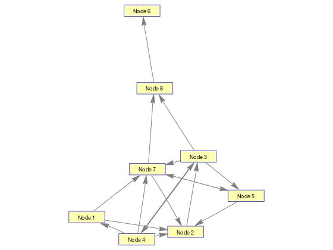
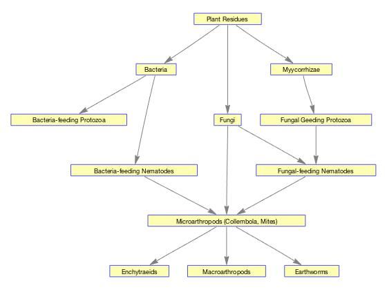

# Assignment 2

### Exercise 2.1.4

#####  Question 1

1. With regards to the adjaceny matrix r, define matrix r in Matlab.

​	See attached code.

##### Question 2

2. With regards to the adjaceny matrix r, how many nodes and edges are in the graph r represents?

   Adjacency matrix r consists of 8 nodes that make up 17 edges as follows:

   `r(1,2)`: Edge from Node 1 to Node 2
   `r(1,7)`: Edge from Node 1 to Node 7
   `r(2,3)`: Edge from Node 2 to Node 3
   `r(3,4)`: Edge from Node 3 to Node 4
   `r(3,5)`: Edge from Node 3 to Node 5
   `r(3,7)`: Edge from Node 3 to Node 7
   `r(3,8)`: Edge from Node 3 to Node 8
   `r(4,1)`: Edge from Node 4 to Node 1
   `r(4,2)`: Edge from Node 4 to Node 2
   `r(4,3)`: Edge from Node 4 to Node 3
   `r(4,7)`: Edge fr om Node 4 to Node 7
   `r(5,2)`: Edge from Node 5 to Node 2
   `r(5,7)`: Edge from Node 5 to Node 7
   `r(7,2)`: Edge from Node 7 to Node 2
   `r(7,5)`: Edge from Node 7 to Node 5
   `r(7,8)`: Edge from Node 7 to Node 8
   `r(8,6)`: Edge from Node 8 to Node 6

##### Question 3

3. With regards to the adjaceny matrix r, draw the graph using Matlab and choose a suitable layout

   

### Exercise 2.1.6

#####  Question 1

1) Draw the soil biota food web given at the start of this example, ignoring the two arrows on the left of the food web that do not end on a particular species. Experiment with the different layout algorithms and the node color and shape.

 


### Source Code

##### Functions File

```matlab
function v = createMatrix(cell)
  % Run the 'CreateRow' function on each vector in the cell
  % `out` is a cell, where each cell element consists of the 
  % updated matrix row
  out = cellfun(@(c) createRow(c, length(cell)), cell,
                'UniformOutput',false);
  % Simply convert the cell back into a matrix
  v = cell2mat(out');

function k = createRow(vector, len)
  row = zeros(1,len);
  row(vector) = 1;
  k = row;
```

##### Script File

```matlab
addpath('./functions')

% Define a cell made of vectors containing the indexes of the
% 'ones' in each row. A row made entirely of zeros will be an
% empty vector at that position. 
idxs = { [2,7],[3],[4 5 7 8],[1 2 3 7],[2 7],[],[2 5 8],[6] }

% Create the custom matrix
m = createMatrix(idxs);

% Draw the m graph using BioGraph
g = biograph(m)
g.LayoutType = 'equilibrium';
dolayout(g);
vg = view(g);


%%%%%%
% Exercise 2.1.6
%%%%%%

nodes = {'Plant Residues' 
         'Bacteria'
         'Fungi'
         'Myycorrhizae'
         'Bacteria-feeding Protozoa'
         'Fungal Geeding Protozoa'
         'Bacteria-feeding Nematodes'
         'Fungal-feeding Nematodes'
         'Microarthropods (Collembola, Mites)'
         'Enchytraeids'
         'Macroarthropods'
         'Earthworms'}

% The idxs are very easy to create, go through the nodes
% from 1 to the end systematically, and create a vector
% of all the nodes that node connects to. e.g. first node
% (Plant Residue) connects to nodes 2,3,4 and so on...
biota_idxs = { [2,3,4],[5,7],[8,9],[6],[],[8],[9],[9],[10,11,12],[],[],[] }
biota = createMatrix(biota_idxs, 12)

% Draw graph 
g=biograph(biota,nodes');
view (g);


```

