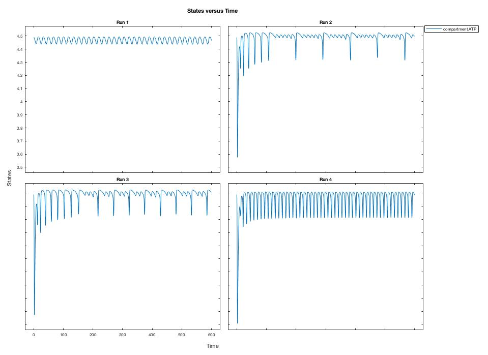
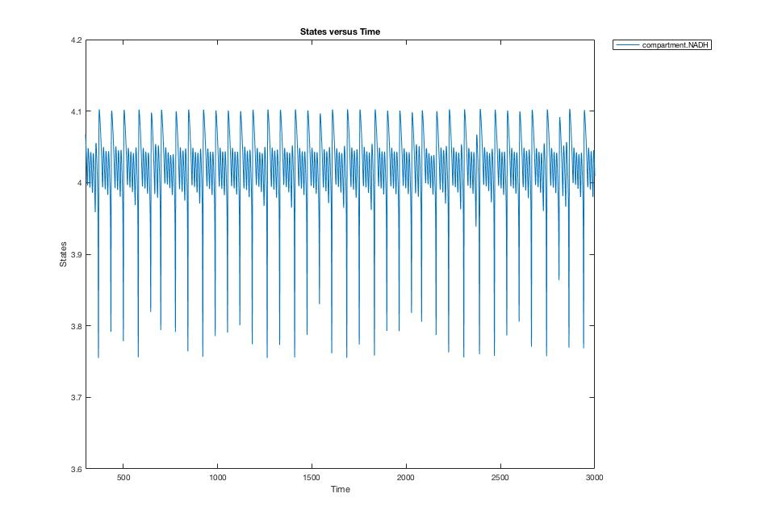

# Assignment 3

### Exercise 2.2.9

##### Question 1

1. Save as a figure the four panelled plots you generated

 

##### Question 2

2. Compare these results to your notes from the last exercise. Is this what you expected?

   Yes, this is as expected. As one increase the flow rate of glucose into the system, the level of compartment ATP reaches equilibrium at a faster rate.

##### Question 3

3. Do you find this transition from periodic stability to chaos and back to stability surprising?

   Yes, this is slightly suprising at a first look. However, looking at the bigger picture, compartment ATP is a part of a bigger system and as such other factors in the system, will affect the stability of ATP.

##### Question 4

4. Did you have anyway to predict this from first principles?

   This could potentially be derived from the sum of the individual rate constacts from each of the equations of production of ATP.

### Exercise 2.2.10

##### Question 1

1. Reproduce Figure 10 of Nielsen et. al. which is an example of chaotic behaviour.
   Hint: You can reproduce an approximation to it by just changing the glucose flow rate and ignoring any behaviour at early times (transient behaviour).

 