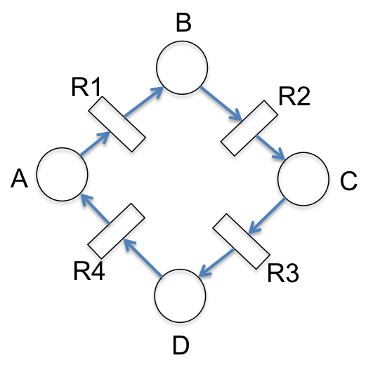
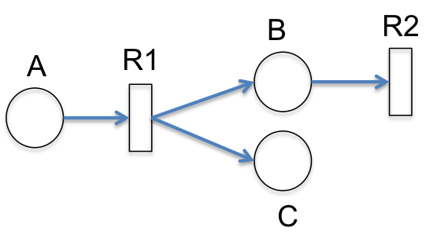

# Assignment 4

### Exercise 1.1.13

##### Question 1



1. Without doing any calculations can you identify any i) conservation laws and ii) sets of reactions which will leave the state unchanged?

   *Conservation Laws:*  A, B, C and D are likely to be p-invariant

   *Set of Reactions which will leave the state unchanged:* R1, R2, R3, R4 are potentially t-invariant.


2. In MATLAB construct the Petri net for this system by defining `ss`,` rr`, `WsrWsr`, `WrsWrs` and `mm`. (Assume the state mm contains one token in species A only.) 

   ​

   ```matlab
   % s = [A; B; C; D]
   % r = [R1; R2; R3; R4]
   W_sr = [1 0 0 0; 0 1 0 0; 0 0 1 0; 0 0 0 1];
   W_rs = [0 1 0 0; 0 0 1 0; 0 0 0 1; 1 0 0 0]; 
   ```


3.  Use these to calculate reaction matrix AA and stoichiometry matrix SS.


    ```matlab
    A = W_rs -W_sr
    %   -1     1     0     0
    %    0    -1     1     0
    %    0     0    -1     1
    %    1     0     0    -1

    S = A'
    %   -1     0     0     1
    %    1    -1     0     0
    %    0     1    -1     0
    %    0     0     1    -1
    ```

    ​

4.  Calculate the P and T invariants for this system and comment on their meanings. Did you identify them in part (a)?

    ```matlab
    t_invariant = null(S, 'r')
    %   1
    %   1
    %   1
    %   1

    p_invariant = null(A, 'r')
    %   1
    %   1
    %   1
    %   1

    ```

    The T invariant represents a set of reactions (R1-R4) that leave the system unchanged while the P invariant represents the individual species (A-D) that remain unchanged. 

    The conservation law for the system suggests that it is left unchanged as shown below:

    ```matlab
    nT − nP = nr − ns
     4 -  4 =  4 - 4 
    	  0 = 0  
    ```


##### Question 2

 

1. Repeat for the above network


   ```matlab
   % s = [A; B; C]
   % r = [R1; R2]
   % m = [1; 0; 0]
   W_sr = [1 0 0; 0 1 0]; 
   W_rs = [0 1 1; 0 0 0]; 


   A = W_rs -W_sr
   %   -1     1     1
   %    0    -1     0

   S = A'
   %   -1     0
   %    1    -1
   %    1     0


   t = null(S, 'r')
   %   Empty matrix: 2-by-0

   p = null(A, 'r')
   %   1
   %   0
   %   1
   ```

   As shown above there are no T-invariants while the P-invariant is [1; 0; 1]. This is value for B in the P-invariant is 0 is potentially due to the fact it undergoes a reaction with no products (i.e. such as a degradation reaction).

   ​