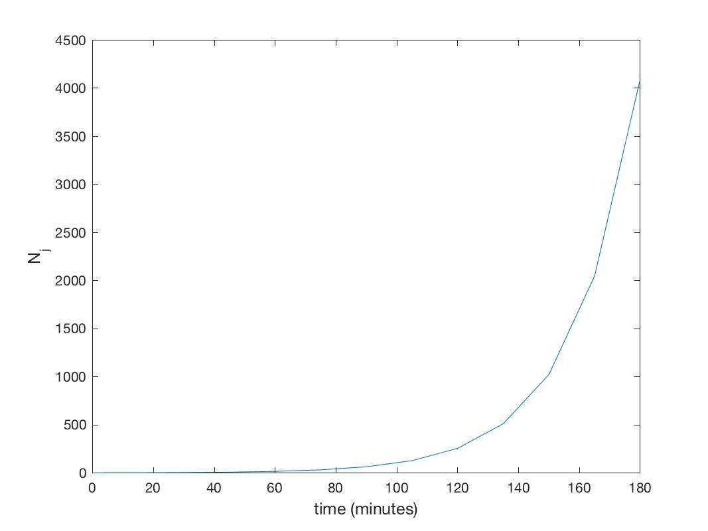
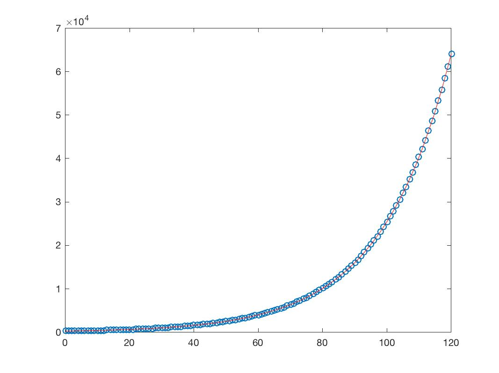
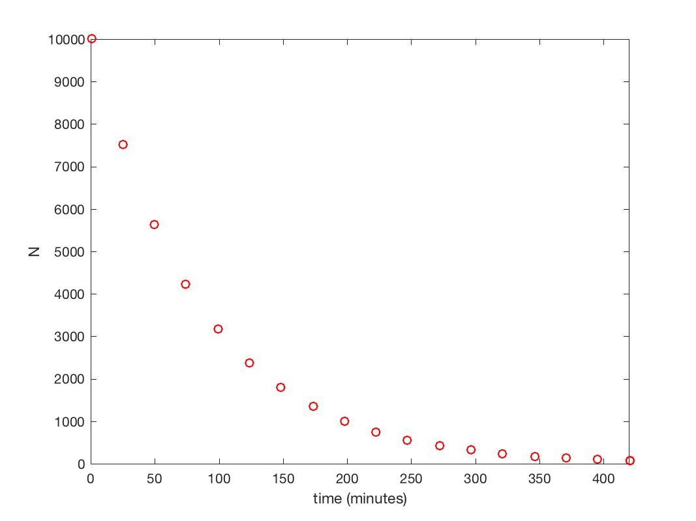
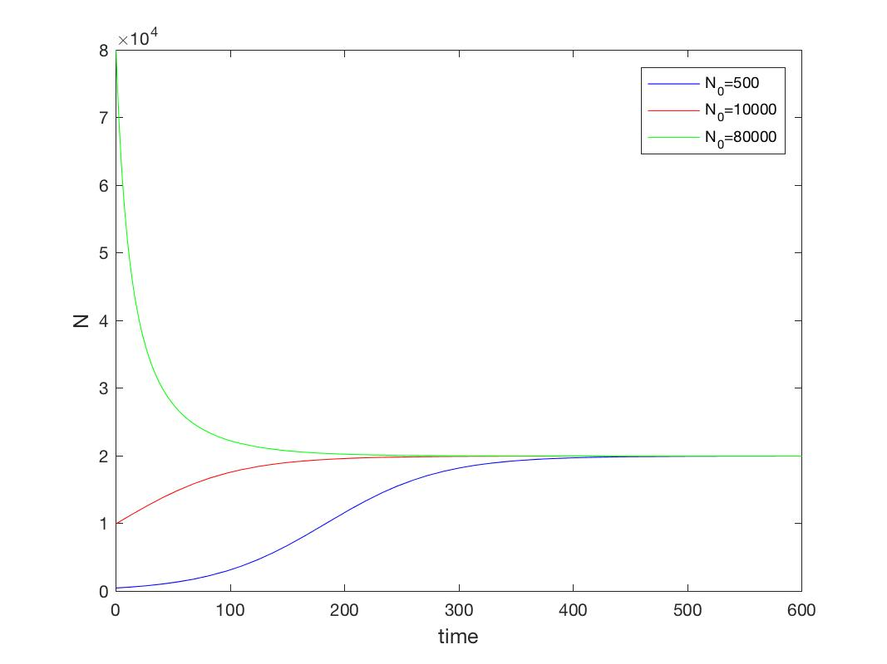

# Assignment 5

### Exercise 1.1.5

1. A single cell of *E-coli* divides every 15 minutes. Write a loop to generate population values over a three hour period and plot them on a graph.


   ```matlab
   time = 0:15:180; 
   N = zeros(1, length(time)); 
   N(1) = 1;
   for j = 2:length(time)
       N(j) = 2*N(j-1); 
   end

   fig = figure;
   plot(time, N) 
   xlabel('time (minutes)','fontsize',12) 
   ylabel('N_j','fontsize',12)
   saveas(fig, 'plot1','jpg');

   ```

   

### Exercise 1.1.7

1. A colony of 250 *E-coli* bacteria has a reproductive cycle of 15 minutes. Its population growth can be modelled with the equivalent equations [1.1.3](https://sysmic.ac.uk/textbook/1.1-bacterial-growth-1.html#eqn5) and [1.1.5](https://sysmic.ac.uk/textbook/1.1-bacterial-growth-1.html#eqn6).  What are the values of $N_0$ , $R$,  and $k$ for this colony?

   ```matlab
   syms N0 R
   assume(R,'real')
   assume(R>0)
   R = solve( 2*N0 == N0*(1+R)^15, R)  
   %   R = 2^(1/15) - 1
   eval (R) 
   %  0.0473

   k = log(1+R) 
   eval (k)
   %  0.0462
   N_o = 250 % given in question 
   ```

   Therefore as shown above, $N_0 = 250$, $R = 0.0473$ and $k = 0.0462$.

2. Plot the population over 2 hours.

   ```matlab
   t2 = 0:1:120;
   N2 = zeros(1, length(t2););
   N2(1) = 250;
   for j=2:length(t2);
        N2(j) = 1.0473*N2(j-1);
   end

   fig = figure;
   plot(t2,N2,'o')
   hold on 
   fun2 = @(t) 250*exp(log(1.0473)*t); 
   limits = [0 120];
   fplot(fun2,limits,'r')
   saveas(fig, 'plot2','jpg');
   ```

   


### Exercise 1.1.9

1. A colony of 10,000 *E-coli* bacteria halves its population every hour. Write code to model the population.

   ```matlab
   fun = @(t) 10000*exp(-0.0116*t); 
   t = 0:420; 
   N = zeros (1,length(t));
   N(1) = 10000; 
   for j=2:length(t)
       N(j)=0.5*N(j-1); 
   end
   ```

2. How many hours would it take for the number of bacterial to fall below 100 members?

   ```matlab
   line ([10,100],[100,100]) 
   values_above_100 = find (N>100);
   t_100 = time(values_above_100(end)+1)
   % 7 minutes 
   ```

   Therefore the colony would fall below100 members within 7 minutes.

3. Plot a graph showing how the population changes over this time

   ```matlab
   fig = figure;
   limits = [0 420];
   fplot(fun,limits, 'ro')
   xlabel('time (minutes)')
   ylabel('N')
   saveas(fig, 'plot3','jpg');
   ```

   

### Exercise 1.1.11

1. The population of a bacteria colony can be modeled by the logistic growth function with parameters $r_0 = 0.02$ and $K = 20000$. Write a MATLAB function to model the population and make a plot of the population over 10 hours for initial populations of 500, 10,000, and 80,000.

   ```matlab
   fun = @(t, r0, N0, K) K*N0*exp(r0*t)/(K-N0+N0*exp(r0*t)); 
   fun1 = @(t) fun(t, 0.02, 500, 20000);
   fun2 = @(t) fun(t, 0.02, 10000, 20000); 
   fun3 = @(t) fun(t, 0.02, 80000, 20000); 
   limits = [0 600];
   fig = figure;
   fplot(fun1,limits,'b')
   hold on
   fplot(fun2,limits,'r')
   hold on 
   fplot (fun3,limits, 'g') 
   xlabel('time','fontsize',12)
   ylabel('N','fontsize',12)
   legend('N_0=500','N_0=10000','N_0=80000')
   axis([-inf,600,0,80000])
   saveas(fig, 'plot4','jpg');
   ```

   

2. Comment on the trend shown in the graph

   When the $N_0$ is lower than $K$, the population size slowly increases toward steady state, where $N = K$. Here the population is at its maximum capacity.

   On the other hand, if the $N_0$ is larger than $K$, the population size is much larger than its maximum capacity and as such the population quickly decreases in size towards its maximum capacity.  


3. If $r_0$ is increased how do these plots change?

   As $r_0$ increases, the initial gradient of the graphs will become steeper as the population reaches steady state quicker. In the above example, the blue and red populations will show a marked, steeper increase in population towards the steady state while the green population will show a marked, steeper decline in population size towards the steady state.


