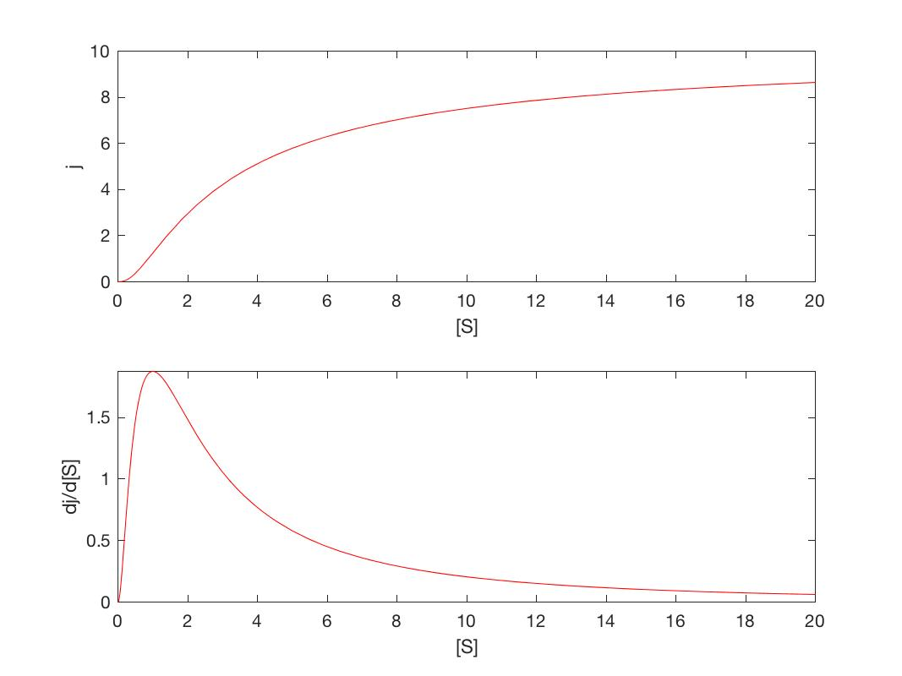
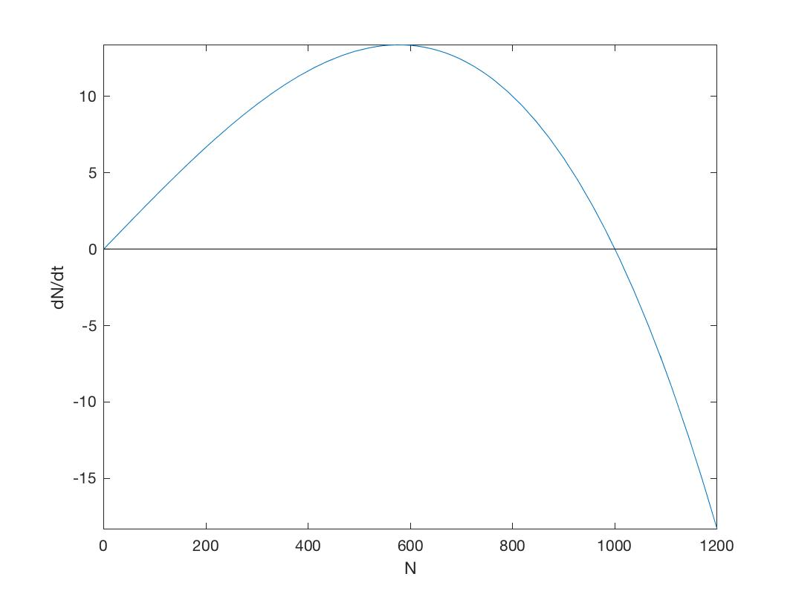
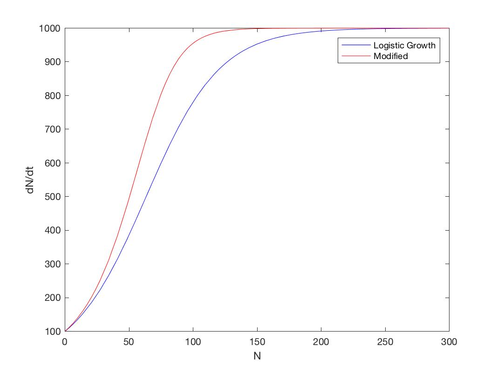
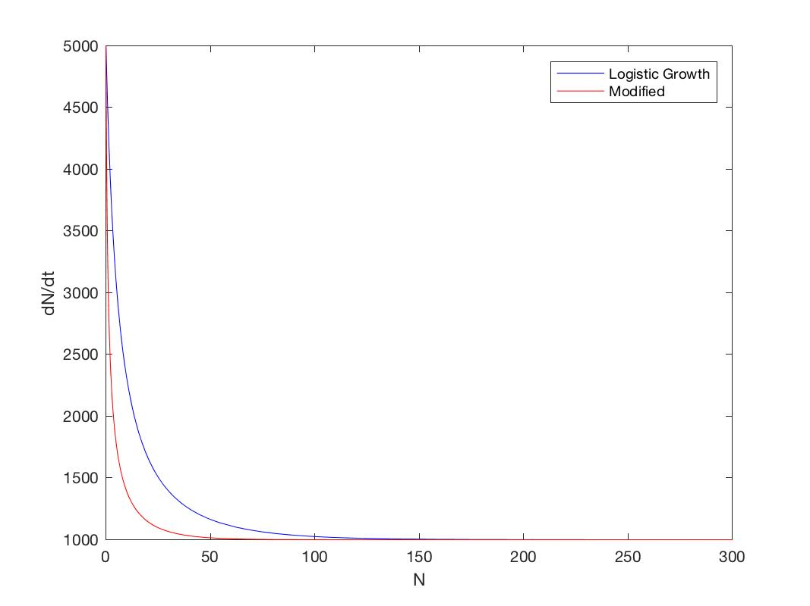

# Assignment 6

### Exercise 1.2.7

1. Consider the reaction in which the rate $j$ can be modelled using $j([S]) = V_{max}[\frac{[S]}{K+[S]}]^n$ where $K, V_{max}, n = \{1.0, 10, 3\}$ Use MATLAB to plot $j$ and $\frac{dj}{d[S]}$.

   ```matlab
   syms S Vmax K n;
   j = Vmax * ( S/(K + S) )^n; 
   dj = diff(j,S);
   mj = matlabFunction(j,'vars',[S,K,Vmax,n]);
   mdj = matlabFunction(dj,'vars',[S,K,Vmax,n]);
   f1 = @(S) mj(S,1,10,3.0);
   f2 = @(S) mdj(S,1,10,3.0);
   limits = [0 20];

   fig = figure;
   subplot(2,1,1)
   fplot(f1,limits,'r')
   axis([0 20 0 10])
   ylabel('j')
   xlabel('[S]')
   subplot(2,1,2)
   fplot(f2,limits,'r')
   ylabel('dj/d[S]')
   xlabel('[S]')
   saveas(fig, 'plot1','jpg');
   ```


   

### Exercise 1.2.8

1. Consider the reaction $j$ with a rate $j([S]) =  V_{max} [\frac{ [S] }{ K + [S] }]^n$. Differentiating this gives $dj/d[S]$: the rate of change of $j$  as the substrate concentration $[*S*]$ changes. We wish to examine $dj/d[S]$ in particular to find the value of $[S_m]$, the concentration at which $dj/d[S]$ is a maximum.  Use MATLAB to find an expression for  $dj/d[S]$ 

   ```matlab
   syms S Vmax K n;
   j = Vmax * ( S/(K + S) )^n; 
   dj = simplify (diff(j,S))
   d2j = simplify (diff(dj,S));
   Sm = solve(d2j,S,'Real',true)
   % (K*n)/2 - K/2
   ```

2. Next use this to find the expression for $j([Sm])$, the reaction rate at which d$j/d[S]$ is a maximum. 

   ```matlab
   jm = Vmax*(Sm/(K + Sm))^n;
   jm = simplify(jm, 'IgnoreAnalyticConstraints', true)
   % (Vmax*(n - 1)^n)/(n + 1)^n
   ```

3. Evaluate these expressions to find $[Sm]$ and $j([Sm])$ with parameters $K,Vmax,n=1,10,3$.


3. ```matlab
   subs (Sm, [K,n],[1.0 3.0]) 
   %  1

   subs (jm, [K,Vmax,n],[1 10 3])
   % 5/4 = 1.25 
   ```

### Exercise 1.3.4

1. A circular colony of bacteria with radius 1000$μ$m has bacterial density $D$ which is dependent only on the distance $r$ from the center, and described by $D=0.1+r/1000$ Use MATLAB to calculate the indefinite integral of the bacterial density function.

   ```matlab
   syms r;
   N = 2*pi*r*(0.1 + r/1000)
   int (N,r) 
   % (pi*r^2*(r + 150))/1500
   % (plus integration constant) 
   ```

   ​

2. Calculate the total number of bacteria in the colony.

   ```matlab
   syms r;
   N = 2*pi*r*(0.1 + r/1000)
   int(N,r,0,1000)  
   % (2300000*pi)/3
   % = 2.4086e+06
   ```

   ​

### Exercise 1.3.6

1. A modified growth model with similar behaviour to logistic growth can be developed from the differential equation: $dN/dt=r(N)$ where $r(N)=r0(1−(NK)2)$ For the following use parameters values $r0=0.0347$ and $K=1000$. For the modified model plot $dN/dt$. 

   ```matlab
   dN = @(N,r0,K) r0*N*(1-(N/K)^2);
   fun = @(N) dN(N,0.0347,1000);
   limits = [0 1200];
   fig = figure;
   fplot(fun, limits)
   line( [0,1200], [0,0], 'Color','k' )
   ylabel('dN/dt')
   xlabel('N')
   saveas(fig, 'plot2','jpg');
   ```
   

2. Use this plot to infer how the population will change at different values of $N$.

   When value of $N$ is between $0$ and $K$, the growth rate will be positive ans as such the population size, $N$ will increase. On the other hand, when $N$ is smaller than $K$, the growth rate is negative causing the population size to decreases. When $N$ is equal to the value of $K$, the growth rate will be zero and as such the population size will not change.

3. Describe how this plot differs from the equivalent plot for the logistic growth model (Figure 1.3.3) 

   The main difference is that the maximum growth rate occurs at $K/2$ for logistic growth model, while here the maximum growth rate occurs at $K$.


4. Use MATLAB to find the value of $N$ at which the growth rate is a maximum.
   ```matlab
   syms N r0 K
   f = r0*N*(1-(N/K)^2);
   df = diff(f,N)
   solve(df==0, N)
    % -(3^(1/2)*K)/3
    %  (3^(1/2)*K)/3   %%% This answer is above 0
    
   ```


5. Find the solution of this differential equation using the dsolve command.
   ```matlab
   N = dsolve('DN=r0*N*(1-(N/K)^2)', 'N(0)=N0', 't')
   N = simplify(N)
   % ((K^2*N0^2*exp(2*r0*t))/(K^2 - N0^2 + N0^2*exp(2*r0*t)))^(1/2)

   ```


6. Create two figures overlaying plots showing population growth for this modified model and the Logistic growth solution (Equation 1.3.3). Do this for both $N0=100$ and $N0=5,000$. Hint. Modify the following code which solves the logistic growth equation and converts it to a MATLAB function.
   ```matlab
   syms L M r0 K t N0
   L=dsolve('DL=r0*L*(1-L/K)','L(0)=N0','t')
   L=simplify(L)
   mL = matlabFunction(L,'vars',[N0,K,r0,t])
   funL100 = @(t) mL(100,1000,0.0347,t);
   funL5000 = @(t) mL(5000,1000,0.0347,t);

   %modified Growth
   M=dsolve('DM=r0*M*(1-(M/K)^2)', 'M(0)=N0','t')
   M=simplify(M)
   mM = matlabFunction(M,'vars',[N0,K,r0,t])
   funM100 = @(t) mM(100,1000,0.0347,t);
   funM5000 = @(t) mM(5000,1000,0.0347,t);

   fig = figure();
   limits = [0 300];
   fplot(funL100, limits, 'b')
   hold on
   fplot(funM100, limits, 'r')
   ylabel('dN/dt')
   xlabel('N')
   legend('Logistic Growth', 'Modified', 'Location', 'NorthEast')
   saveas(fig, 'plot3','jpg');

   fig = figure();
   limits = [0 300];
   fplot(funL5000, limits, 'b')
   hold on
   fplot(funM5000, limits, 'r')
   ylabel('dN/dt')
   xlabel('N')
   legend('Logistic Growth', 'Modified', 'Location', 'NorthEast')
   axis([0,300,1000,5000])
   saveas(fig, 'plot4','jpg');

   ```

   

   

7. Describe the differences between the graphs.

   Both functions reach same steady states but the modified growth function reaches steady state more quickly. 

   ​