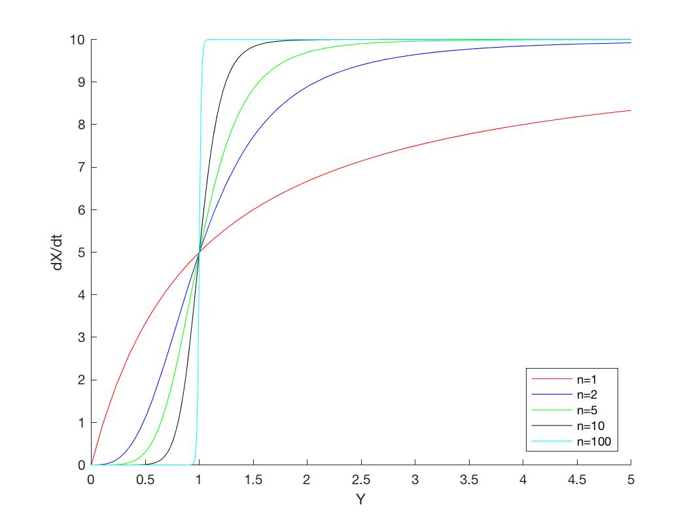
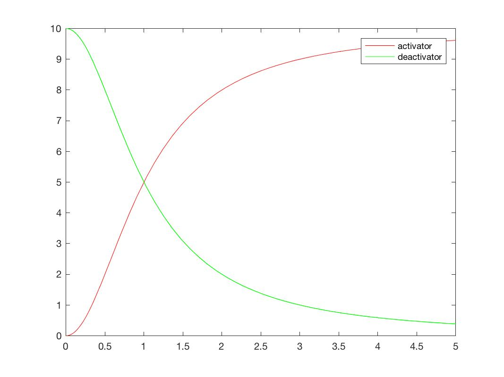
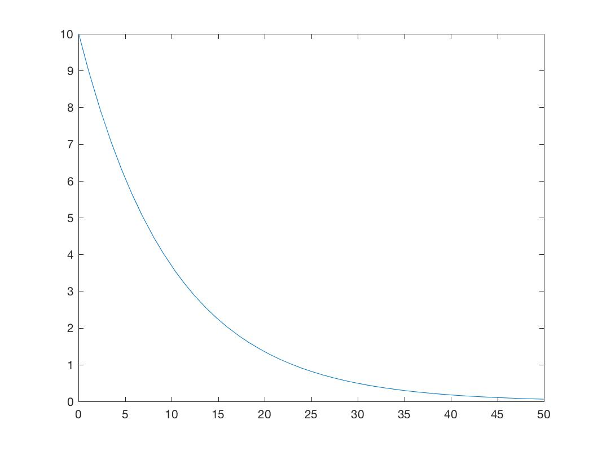
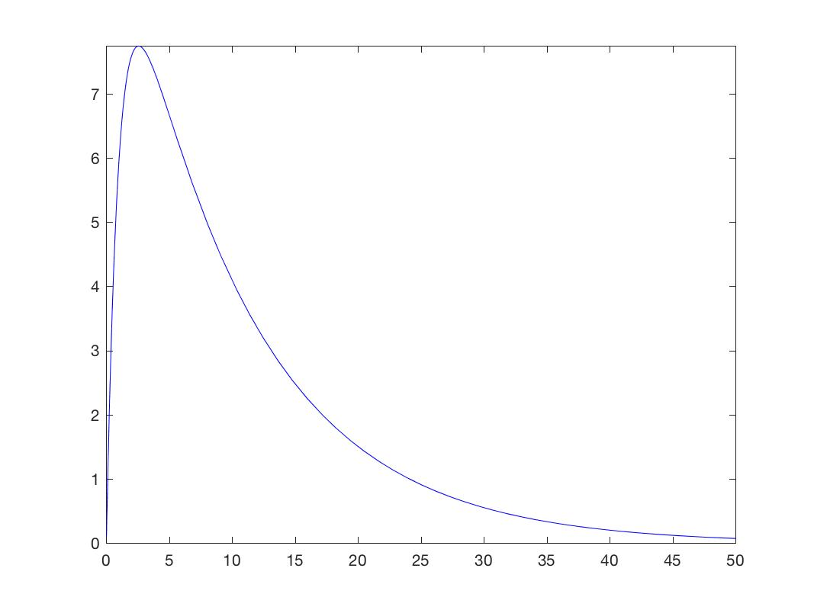
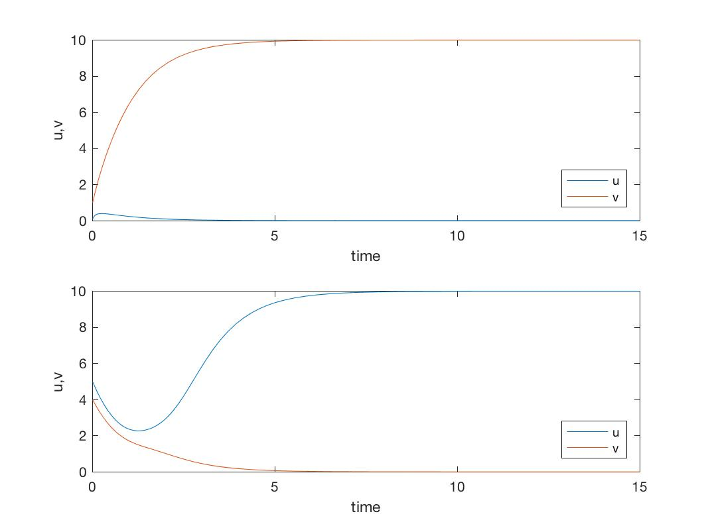

# Assignment 7

### Exercise 1.4.1

1. Modify the MATLAB function to model gene expression in the presence of an activator. 

   ```matlab
   v = @(Y,K,k,n) k*Y^n/(K^n + Y^n);
   ns = [1 3 5 10 100]; 
   cols = ['r' 'b' 'g' 'k' 'c'];
   limits = [0 5];
   fig = figure;
   hold on
   for i=1:5,
       vt = @(Y) v(Y,1,10,ns(i));
       fplot(vt,limits,cols(i));
   end
   axis([0 5 0 10]);
   ylabel('dX/dt');
   xlabel('Y');
   legend('n=1','n=2','n=5','n=10','n=100','Location','SouthEast');
   saveas(fig, 'plot1','jpg');

   ```

   

2. Overlay plots for the activator and repressor cases, using parameter values of $K=$1,$k=10$ and $n=2$.

   ```matlab
   v = @(Y,K,k,n) k*Y^n/(K^n + Y^n);
   v1 = @(Y,K,k,n) k*K^n/(K^n + Y^n);
   % n = 2; K = 1; k = 10; 
   vt = @(Y) v(Y,1,10,2);
   v1t = @(Y) v1(Y,1,10,2);

   fig= figure;
   fplot(vt,limits, 'r');
   hold on 
   fplot(v1t,limits, 'g');
   legend('v1','v1t')
   saveas(fig, 'plot2','jpg');
   ```

   

3. What do you notice about the graphs?

   With an activator, there is an increase in gene expression, while there is a decrease in the presence of a repressor.

### Exercise 1.4.4

1. Look at the code which models expression of $X$ regulated by transcription factor $Y$ in a system described by the equations $\frac{dX}{dt} =gY−bX$ and $\frac{dY}{dt} = c$. Consider a process in which $c=0.1, b=1, g=1$  and the initial concentrations are $X_0=0.1$ and $Y_0=10$.

   ```matlab
   r=dsolve('DX=g*Y - b*X','DY=-c*Y','X(0)=X0','Y(0)=Y0','t');
   X=simplify(r.X)
   % (Y0*g*exp(-c*t))/(b - c) - (exp(-b*t)*(X0*c - X0*b + Y0*g))/(b - c)
   Y=simplify(r.Y)
   % Y0*exp(-c*t)
   ```

2. Modify the MATLAB code to solve the differential equations if the concentration of $Y$ is now described by $\frac{dY}/{dt}=−cY$ with initial condition that $Y(t=0)=Y_0$ and $X(t=0)=X_0$.

   ```matlab
   syms t Y0 c
   mY = matlabFunction (Y, 'vars', [t Y0 c]);
   fY_1 = @ (t) mY (t,10,0.1);
   fig = figure;
   fplot (fY_1, [0 50]) 
   saveas(fig, 'plot3','jpg');
   ```

3. Plot the concentration $Y(t)$ against time.

   

4. Examine the solution for $Y(t)$ you found. What type of mathematical function is it?

   An exponential decline.

5. Plot $X(t)$ against time.

   ```matlab
   syms t b X0 c g Y0 
   mX = matlabFunction (X, 'vars', [t b X0 c g Y0]);
   fX_1 = @ (t) mX (t,1,0.1,0.1,1,10);
   fig = figure;
   fplot (fX_1, [0 50], 'b') 
   saveas(fig, 'plot4','jpg');
   ```

   

6. How has modifying $\frac{dY}{dt}$ changed the behavior of $X(t)$?

   $fX1$ decays exponentially after an initial peak, while $fX1$ simply undergoes an exponential decay. This could potentially be explained if $fY1$ is an activator for $fX1$. 

### Exercise 1.5.1

1. Another toggle system can be modelled with the equations

   ​					$\begin{align*}\frac{du}{dt} & = \frac{ \alpha_1 }{ \exp({\beta}v) } - u \\  \frac{dv}{dt} & = \frac{ \alpha_2 }{ \exp({\gamma}u) } - v. \\ \end{align*}$

   ​

   Modify the MATLAB code to numerically integrate these equations. Take $\alpha_1 , \alpha_2 = 10, \beta , \gamma=3$ Hint: You can then re-run the same toggle system code. Only `toggle.m` needs to be altered. (Remember to also change the values of $β$ and $γ$). 

   ```matlab
   % toggle.m
   function ydot=toggle(t,y)
       alpha1 = 10.0;
       alpha2 = 10.0;
       beta = 3.0;
       gamma = 3.0;
       
       du = -y(1) + alpha1/(1+(y(2)^beta));
       dv = -y(2) + alpha2/(1+(y(1)^gamma));
       
       ydot = [du; dv]
   ```

   ​	

2. Plot the concentrations of $u$ and $v$ when $u_0,v_0=0.1,1.0$ and $u_0,v_0=5.0,4.0$

   ```matlab
   timespan = [0 15];
   fig = figure
   subplot (2,1,1);
   y0 = [0.1 1.0];
   [t,y] = ode45 (@ toggle,timespan,y0); 
   plot (t,y)
   ylabel ('u,v')
   xlabel('time') 
   legend ('u','v', 'Location','SouthEast')
   subplot (2,1,2);
   y0 = [5.0 4.0];
   [t,y] = ode45 (@toggle,timespan,y0);
   plot (t,y) 
   ylabel ('u,v')
   xlabel ('time')
   legend ('u','v','Location','SouthEast')
   saveas(fig, 'plot5','jpg');

   ```

   


