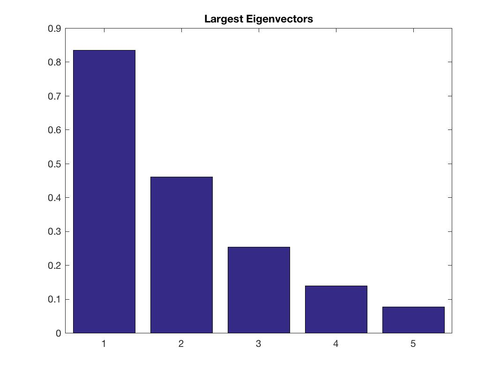
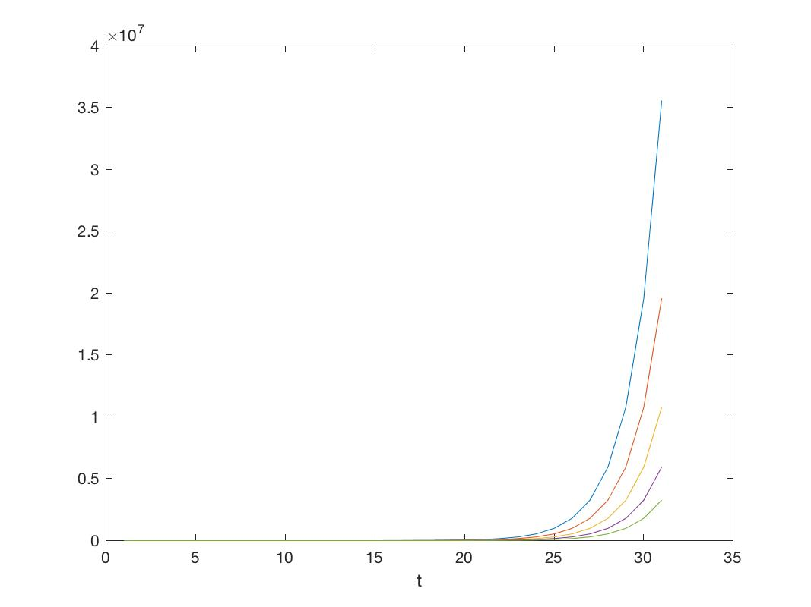
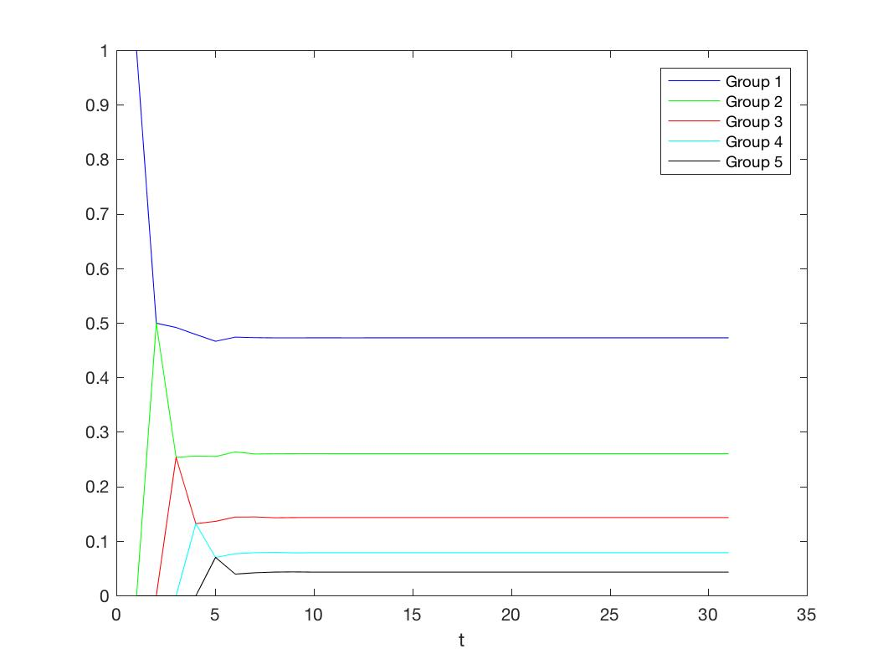
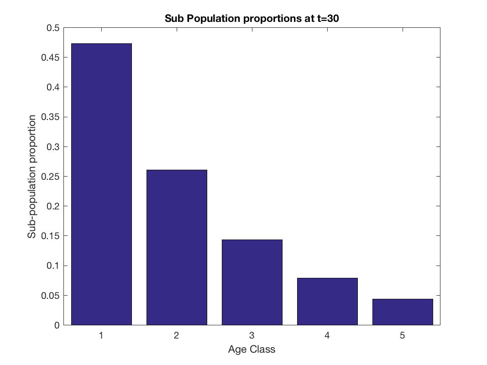

# Assignment 2.1

### Exercise 1.1.9

#####  Question 1
Reproduce and check Figure 3a from Watve et al.

1) Calculate the R vector according to the function above assuming a = 0.063 and b = 2. 

```matlab
a = 0.063;
b = 2;
Rn = zeros(1,5);
for i=1:5
  Rn(i) = 1 - a*(i-1)^b
  if Rn(i)<0
      Rn(i)=0;
  end
end
Rn
% Rn =
%
%   1.0000    0.9370    0.7480    0.4330         0
```

2) Set up the Leslie matrix with this R vector. 

```matlab
L = [1.000 0.9370 0.748 0.433 0; 1 0 0 0 0; 0 1 0 0 0; 0 0 1 0 0; 0 0 0 1 0]
% 1.0000    0.9370    0.7480    0.4330         0
% 1.0000         0         0         0         0
%      0    1.0000         0         0         0
%      0         0    1.0000         0         0
%      0         0         0    1.0000         0
```

3) Calculate the eigenvectors of L.

```matlab
[V,D] = eig(L)
% V =
%   Columns 1 through 5
%    0.0000 + 0.0000i   0.8357 + 0.0000i  -0.0947 + 0.0000i   0.0963 + 0.0858i   0.0963 - 0.0858i
%    0.0000 + 0.0000i   0.4603 + 0.0000i   0.1622 + 0.0000i   0.1048 - 0.1725i   0.1048 + 0.1725i
%    0.0000 + 0.0000i   0.2536 + 0.0000i  -0.2776 + 0.0000i  -0.2952 - 0.1124i  -0.2952 + 0.1124i
%    0.0000 + 0.0000i   0.1397 + 0.0000i   0.4752 + 0.0000i  -0.0895 + 0.4862i  -0.0895 - 0.4862i
%    1.0000 + 0.0000i   0.0769 + 0.0000i  -0.8135 + 0.0000i   0.7736 + 0.0000i   0.7736 + 0.0000i

% D =
%   Columns 1 through 5
%    0.0000 + 0.0000i   0.0000 + 0.0000i   0.0000 + 0.0000i  0.0000 + 0.0000i   0.0000 + 0.0000i
%    0.0000 + 0.0000i   1.8154 + 0.0000i   0.0000 + 0.0000i  0.0000 + 0.0000i   0.0000 + 0.0000i
%    0.0000 + 0.0000i   0.0000 + 0.0000i  -0.5842 + 0.0000i  0.0000 + 0.0000i   0.0000 + 0.0000i
%    0.0000 + 0.0000i   0.0000 + 0.0000i   0.0000 + 0.0000i -0.1156 + 0.6284i   0.0000 + 0.0000i
%    0.0000 + 0.0000i   0.0000 + 0.0000i   0.0000 + 0.0000i  0.0000 + 0.0000i  -0.1156 - 0.6284i
```

4) Find the largest eigenvector and eigenvalue of L and normalise the largest eigenvector.

```matlab
V(:, 2)'
% ans =
%   0.8357    0.4603    0.2536    0.1397    0.0769
```

5) Plot the largest eigenvector as a bar chart.

```matlab
fig = figure;
bar(V(:, 2)')
title('Largest Eigenvectors')
saveas(fig, 'fig1', 'jpg')
```



6) Use this Leslie matrix to generate a time series of 30 time points for the sub populations. Plot the sub population (they should all grow exponentially).

```matlab
time_series = zeros(5,31)
time_series(:,1) = [1; 0; 0; 0; 0];
for i=2:31
  time_series(:,i) = L*time_series(:,i-1)
end

fig2 = figure;
plot( time_series' )
xlabel('t')
saveas(fig2, 'fig2', 'jpg')

```



7) Calculate and plot the sub population proportions as a time series. They should all reach steady state levels.

```matlab
s = sum(time_series);
fig3 = figure;
plot( time_series(1,:)./s,'Blue')
hold on
plot( time_series(2,:)./s,'Green')
plot( time_series(3,:)./s,'Red')
plot( time_series(4,:)./s,'Cyan')
plot( time_series(5,:)./s,'Black')

xlabel('t')
legend('Age Class 1','Age Class 2','Age Class 3','Age Class 4','Age Class 5')
saveas(fig3, 'fig3','jpg');

```



8) Pick the values of the sub population proportions at time t=30 and plot them as a bar chart. This bar chart should be identical to the one generated using the eigenvectors of L (see above).

```matlab
a1 = time_series(1,:)./s;
a2 = time_series(2,:)./s;
a3 = time_series(3,:)./s;
a4 = time_series(4,:)./s;
a5 = time_series(5,:)./s;

sub_pop30 = [ a1(30) a2(30) a3(30) a4(30) a5(30) ];

fig4 = figure;
bar( sub_pop30 )
title('Sub Population proportions at t=30')
xlabel('Age Class')
ylabel('Sub-population proportion')

saveas(fig4, 'fig4', 'jpg')

```




