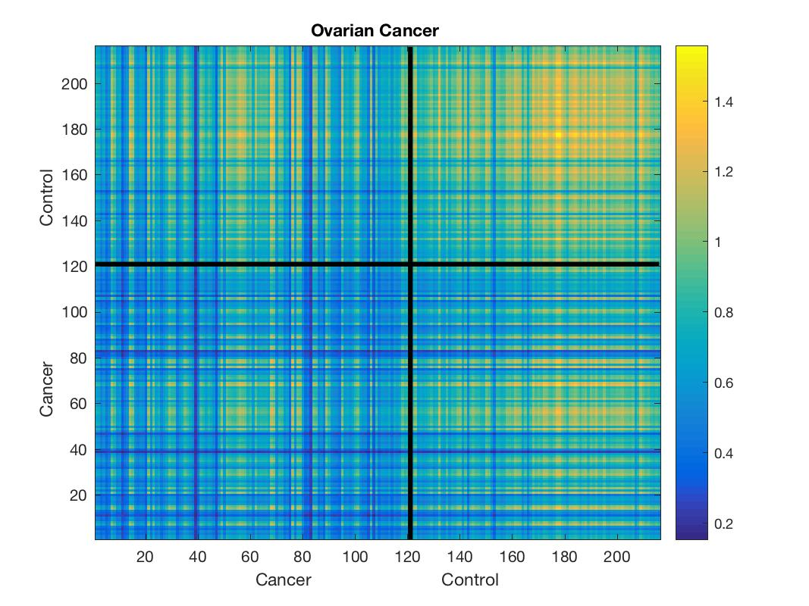
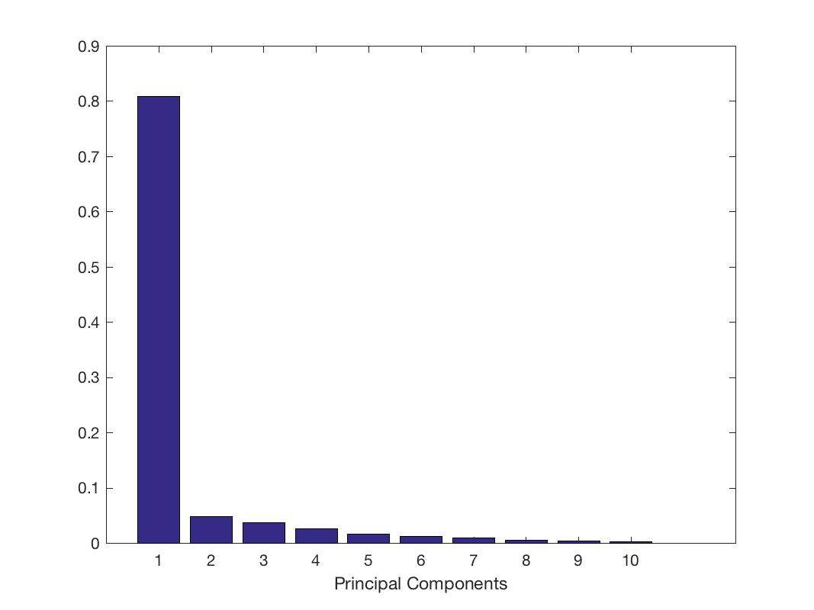
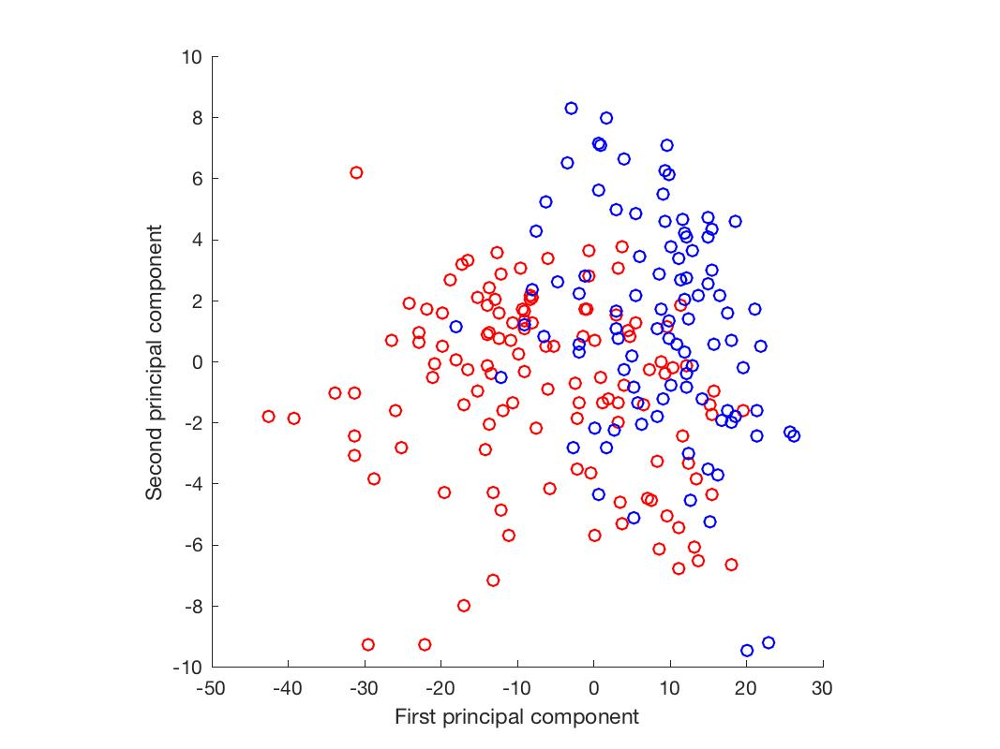

# Assignment 2.2

### Exercise 1.1.7

#####  Question 1

Calculate the covariance matrix from the ovarian cancer data. Plot the matrix using imagesc. Mark the healthy and patient groups. For output, see Figure 1.1.15.

```matlab
load ovariancancer

number_of_cancer = sum(strcmp(grp,'Cancer') )

load ovariancancer;
fig = figure
imagesc(cov(obs'));
title('Ovarian Cancer ')
set(gca,'YDir','normal')
hold on
x=[number_of_cancer number_of_cancer];
y=[0 216];
line(x,y, 'LineWidth', 3, 'Color', [0 0 0])
x2=[0 216];
y2=[number_of_cancer number_of_cancer];
line(x2,y2, 'LineWidth', 3, 'Color', [0 0 0])
hold off

xlabel('Cancer                           Control')
ylabel('Cancer                           Control')
colorbar
saveas(fig, 'figure1','jpg');
```



### Exercise 1.1.8

#####  Question 1

Apply principal component analysis (using pca) to the ovarian cancer data. Make a bar chart (using bar) displaying the first 10 normalised eigenvalues

```matlab
[pc,scores,ev] = pca(obs);

fig = figure();
bar(ev(1:10)./sum(ev))
xlabel('Principal Components')
saveas(fig, 'figure2','jpg');

```



### Exercise 1.1.9

#####  Question 1
Make a plot of the data in the coordinate system defined by PC1 and PC2. You can use the scores returned from pca. Colour the scatter plot by status. Hint: Check the labels in grp to assign the groups

```matlab
[pc,scores,ev] = pca(obs);
pc1 = scores(:,1);
pc2 = scores(:,2);
pc1_normal = pc1(strcmp(grp, 'Normal'));
pc2_normal = pc2(strcmp(grp, 'Normal'));

pc1_cancer = pc1(strcmp(grp, 'Cancer'));
pc2_cancer = pc2(strcmp(grp, 'Cancer'));

fig = figure();
scatter(pc1_cancer, pc2_cancer, 'r');
axis square;
xlabel('PC1')
ylabel('PC2')
hold on;
scatter(pc1_normal, pc2_normal, 'b');
saveas(fig, 'figure3','jpg');
```

